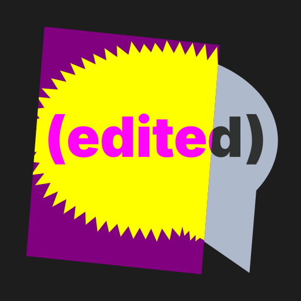

#  Edited

<sup>Ask, answer, edit, repeat.</sup>

<!-- [Try the demo online!](https://ugackMiner53.github.io/edited) -->

Edited is a game about changing your friends' questions
so that their answers look *as bad as possible*.


## Setup

You should be able to play the game via [trystero](https://github.com/dmotz/trystero),
a peer-to-peer connection system that uses public infrastructure to connect players.

However, trystero can take quite a while to connect, and some players may face invisible
connection issues based on their network setup and firewall policies.
Because of this, trystero connections use green bubbles.

If you'd like better connection times, along with __blue bubbles__,
you can try self-hosting Edited with Websockets!


## Self-Hosting

To self-host Edited, make sure that you have a Javascript runtime and packager installed
(`npm`, `pnpm`, `bun`), and the code downloaded.

```console
> pnpm install

> pnpm run build

> pnpm run preview
```

The server should then be available on port 4173 by default, but that can be reconfigured
and/or manually run from the `build/` folder.

If you're hosting Edited on your own server, make sure to update the OpenGraph
URLs in `src/app.html` to use your website instead of the default one.

You can also edit the configuration in `.env` if you'd like a different PIN length
or (for some reason) to self-host the trystero networking method.


## Credits (and Contributing)

Thanks a ton to all of the people over the last four years who have been a part
of testing this game through all of its iterations.
From my closest friends to the random strangers who agreed to try it, you've
all been a part of making this a better game, and I thank you.

If you'd like to contribute to Edited, you can [open a Pull Request](https://github.com/ugackMiner53/edited/pulls)
with your contributions, or [create an Issue](https://github.com/ugackMiner53/edited/issues) with your request!

